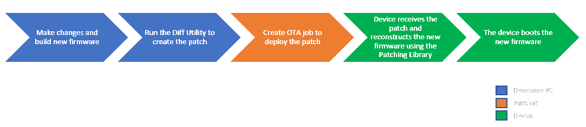

- [1. Introduction](#1-introduction)
  - [1.1. Plan](#11-plan)
  - [1.2. Goals](#12-goals)
    - [1.2.1. ESP32](#121-esp32)
    - [1.2.2. Embedded Linux](#122-embedded-linux)
  - [1.3. Methods Discovered](#13-methods-discovered)
    - [1.3.1. ESP32](#131-esp32)
    - [1.3.2. Embedded Linux](#132-embedded-linux)
  - [1.4. Conclusion](#14-conclusion)
  - [1.5. Refs](#15-refs)
  - [1.6. Footnote](#16-footnote)

# 1. Introduction

The goal of the project is to have a way to "easily" update ioT devices over the air.
These methods should be as platform independent as possible and reusable whenever possible.
I will be looking for already existing methods to do so.
Writing pieces of software whenever needed.

---

## 1.1. Plan

  - Find the specific goal and constraints of the needed software.
  - Look within Verhaert for implimentations already in use.
  - Scour the internet for existing solutions
  - Get a solution to work in a prototype
  - Refine the prototype to a complete demonstration
  - Document the entire process (Will be done throughout the entire project)

---

## 1.2. Goals

### 1.2.1. ESP32

  - [ ] Finding OTA Solutions
  - [ ] Getting OTA to work
  - [ ] Working demonstration
  - [ ] Finished paperwork
  
### 1.2.2. Embedded Linux

  - [ ] Finding OTA Solutions
  - [ ] Getting OTA to work
  - [ ] Working demonstration
  - [ ] Finished paperwork
  
---

## 1.3. Methods Discovered

### 1.3.1. ESP32

  - [FreeRTOS Delta OTA](https://www.freertos.org/2022/01/delta-over-the-air-updates.html)
      - Uses [AWS IoT AWS lib](https://github.com/aws/ota-for-aws-iot-embedded-sdk)
      - Overview: 
      - Process:  
        
      - Advantages:
      - Disadvantages:
      - Conclusion:
      - [Demo](esp32/FreeRTOS/demo/README.md)
  - [Espressif OTA](https://docs.espressif.com/projects/esp-idf/en/latest/esp32/api-reference/system/ota.html)
    - Overview 
    - Advantages:
      - Python CLI exists
      - Can be used as library to develop an app
      - Relatively safe (works with OTA slots)
    - Disadvantages:
      - Device and framework specific (only works on ESP32 with espressif framework)
    - Conclusion:
    - [Demo]()

### 1.3.2. Embedded Linux
  - [Mender](https://mender.io/)
    - Overview:
    - Advantages:
    - Disadvantages: 
    - [Docs]()
    - [Demo]()
  - [SWUpdate](https://swupdate.org)
    - Overview:
    - Advantages:
    - Disadvantages: 
    - [Docs](https://sbabic.github.io/swupdate/swupdate.html)
    - [Demo]()
  - [JFrog](https://jfrog.com/)
    - Overview:
    - Advantages:
    - Disadvantages: 
    - [Docs]()
    - [Demo]()
  
---

## 1.4. Conclusion

---

## 1.5. Refs

---

## 1.6. Footnote

---
