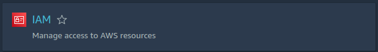
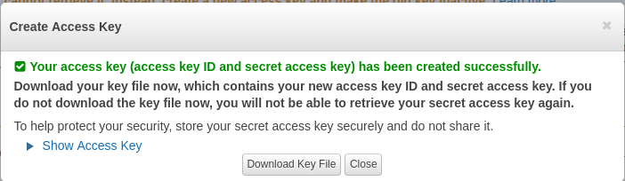
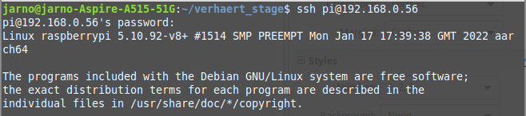
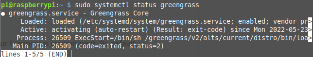
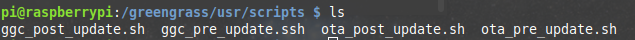
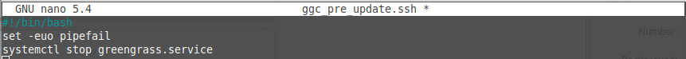
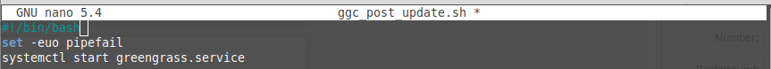

Requirements: An AWS account, an embedded device with an internet connection with which you can communicate over SSH (In this case RPI 4B).

First, an Access key and Secret key must be created, so that you can connect your device to the cloud. To do this, go to “IAM” from AWS.  

From here go to “Manage access keys” and click on “Create New Access Key"  

A new key pair has now been generated. Download this and save it somewhere, you can no longer find the secret-key on the website later.

After you boot the pi and connect to it via SSH.

The next step is to load the configs needed to install the AWS Greengass Core. These are loaded in /proc/config.gz, if not they need to be loaded. This can be done with the command “sudo modprobe configs”.

For simplicity, we are going to export the access-key and secret-key as environment variables.  
*export AWS_ACCESS_KEY_ID=your_provided_access_key*  
*export AWS_SECRET_ACCESS_KEY=your_provided_secret_access_key*  

Then download and run the installation script.    
*wget -q -O ./gg-device-setup-latest.sh https://d1onfpft10uf5o.cloudfront.net/greengrass-device-setup/downloads/gg-device-setup-latest.sh && chmod +x ./gg -device-setup-latest.sh && sudo -E ./gg-device-setup-latest.sh bootstrap-greengrass-interactive*  

During the installation, the script will ask for the access-key and secret-key; Since these are stored as environment variables you can just press enter.
Later it will also ask for region, group name and device name. Here you enter the region group name and device name of your choice.  

If everything goes well during the installation, Greengrass Core will now run as a daemon on your device. To test if Greengrass is loaded effectively you can run the command “sudo systemctl status greengrass-service”.

Next, it is necessary to add the GreengrassOTAUpdateArtifactAccess policy to the “IAM” interface. This allows Core devices to access update artifacts (Package containing update information and data).

The agent needs four scripts to run before and after updates:
- ggc_pre_update.sh
- ggc_post_update.sh
- ota_pre_update.sh
-  ota_post_update.sh
 
These should be in the folder /greengrass/usr/scripts/.

The “ggc_pre_update.ssh” script is executed before an update. It is important to stop all important services here and back up all relevant data. After the update, “ggc_post_update.ssh” will be started, with this you can turn on all necessary services again. Since nothing important is running on the PI used as an example, we just stop and restart the Greengrass service.

Finally, in the config.json (/greengrass/configs/config.json) set “managedRespawn” as true. This gives Greengrass permission to run the scripts.
Now it's time to start the OTA agent. This can be done by creating a script or starting it manually. In this example I start it manually.  
*sudo /greengrass/ota/ota_agent/ggc-ota*  
From now on you can send new software via the AWS website via the IoT web console. This can be done under Manage→Jobs→Create job.
