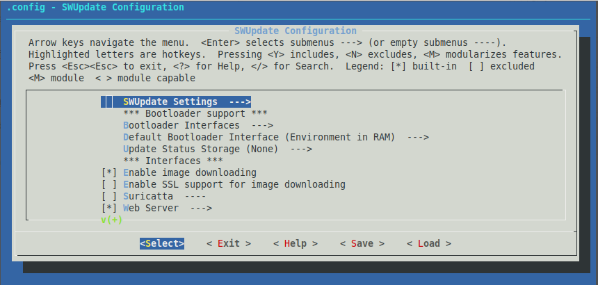
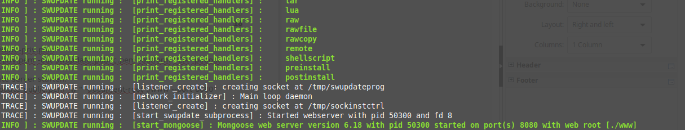
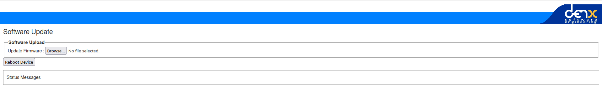

Requirements: An embedded device with an internet connection with which you can communicate over SSH (In this case RPI 4B).

First of all, the necessary libraries must be installed.  
*sudo apt-get update*  
*sudo apt-get install lua5.2-dev libssl-dev libconfig-dev libarchive-dev libzmq3-dev libz-dev libcurl4-gnutls-dev libjson-c-dev*  
After this SWUpdate can be downloaded and we navigate to that folder.  
*git clone https://github.com/sbabic/swupdate.git && cd swupdate*  
For this example I'm using the *test_defconfig*, it can be loaded with:
*make test_defconfig*  
After this we can run *make menuconfig*, with this we can configure further.

For this example, the default settings are sufficient.  
Then it's time to build and install.  
*make && sudo make install*  
For security, a public-/secret-key -- key-pair is required. For ease of use I generate this on the RPI itself.  
*cd*  
*openssl genrsa -out swupdate-priv.pem*  
*openssl rsa -in swupdate-priv.pem -out swupdate-public.pem -outform PEM -pubout*  

now we can start the SWUpdate server.  
*sudo swupdate -v -k swupdate-public.pem -w "--document-root ./swupdate/www --port 8080"*  

If the server has started successfully we can now browser to http://*IP_PI*:8080.

From here we can upload an image to the device or reboot the device.

