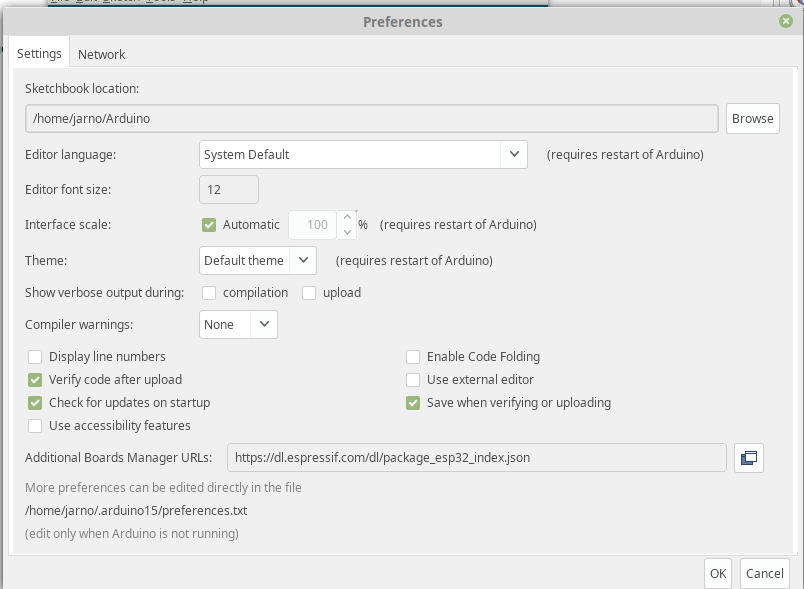
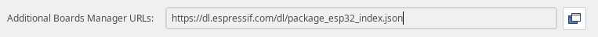
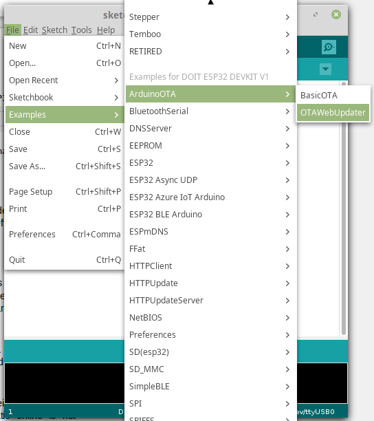
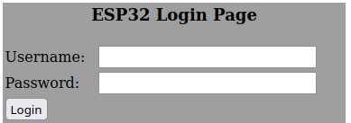
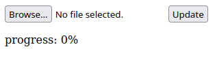
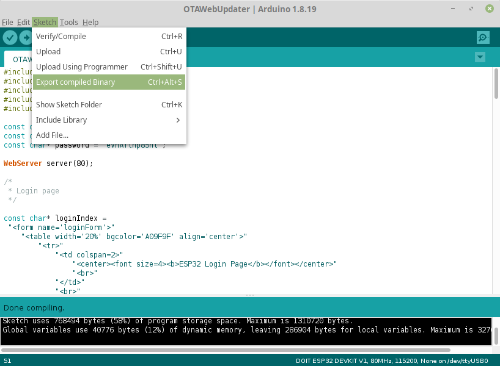
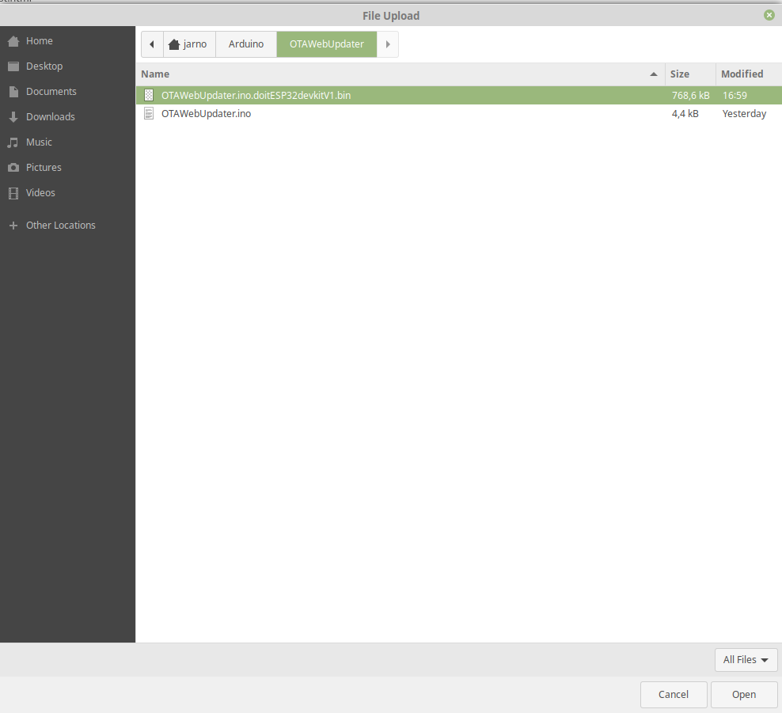
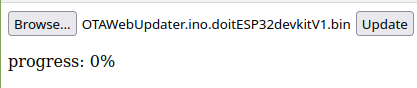

For this example I'm using an ESP32 board and the Arduino IDE.

First of all, the ESP32 board manager must be added.
To do this, go to File→Preferences.  

After this you have to add the ESP32's to the “Additional Boards Managers URLs”.  

From now on you can import sample code for the ESP32. To do this, go to File→Examples. Now we are using OTAWebUpdater under ArduinoOTA.  

Now in the code enter your wifi's SSID and password and upload the sketch.  
After you can surf to the IP address of the ESP32 and log in; The default username and password are “admin”, “admin”. This can be changed in the code.  

If you give the correct login you will come to a site where you can upload the binary to the ESP32 board.  

To generate this binary go to Sketch→Export compiled Binary.  

After this you can select it in the browser and upload it.
  

